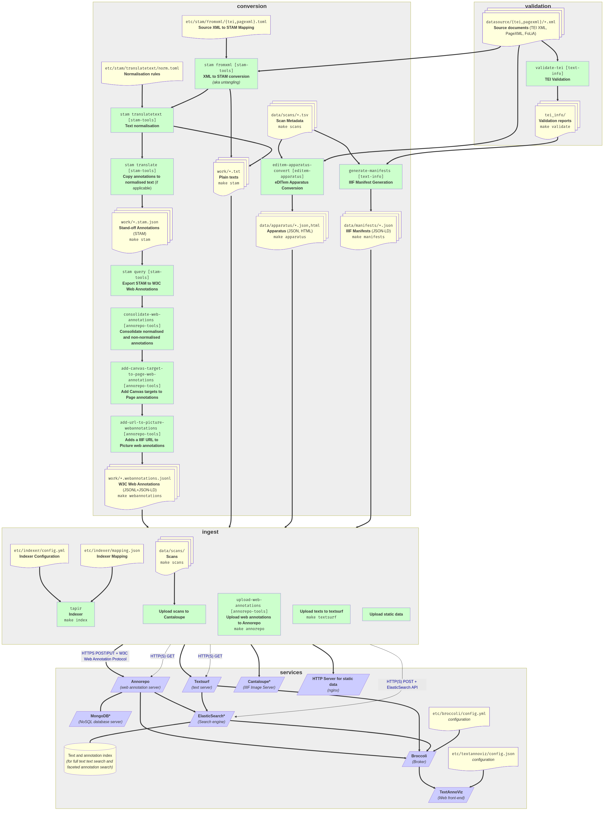

# Team Text - Software Architecture Overview

## Introduction

This document presents the wider architecture developed by [Team
Text](https://di.huc.knaw.nl/tekstanalyse-nl.html) at the KNAW Humanities
Cluster. All in-house software mentioned in this documentation can be found via
<https://tools.huc.knaw.nl>.

The document serves both as an internal reference, as well as a technical show-case to
external parties.

## 1. Service Oriented Architecture for Text Collections

We have ample experience publishing diverse scientific text collections. These
may be literary text editions, historical manuscripts, linguistically-annotated
collections or large corpora from automatic OCR or Handwritten Text
Recognition.

## 3. Data Enrichment pipelines

Most data enrichment pipelines are documented elsewhere (direct links to schemas or READMEs/documentation with schemas):
:

* [Globalise Language Detection pipeline](https://github.com/knaw-huc/globalise-tools/blob/main/pipelines/langdetect/)
* [Globalise Query Expansion pipeline (kweepeer)](https://github.com/knaw-huc/kweepeer)

## 4. Data Models

Data models can be found elsewhere as well (direct links to schemas or READMEs/documentation with schemas):

* [STAM](https://github.com/annotation/stam)
* [Text Fabric](https://annotation.github.io/text-fabric/tf/about/datamodel.html)
* [FoLiA](https://github.com/proycon/folia)
