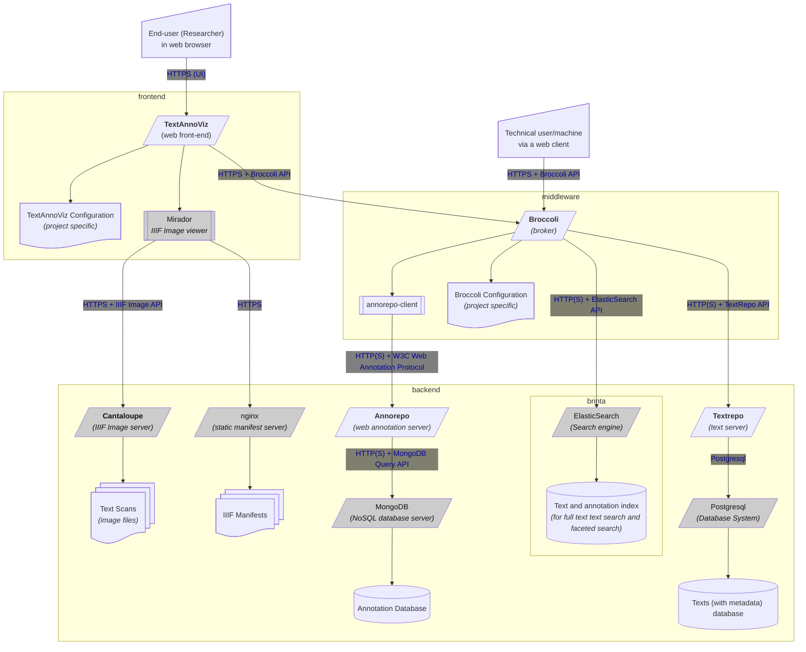

# Team Text - Software Architecture Overview

## Introduction

This document presents the wider architecture developed by [Team
Text](https://di.huc.knaw.nl/tekstanalyse-nl.html) at the KNAW Humanities
Cluster. All in-house software mentioned in this documentation can be found via
<https://tools.huc.knaw.nl>.

The document serves both as an internal reference, as well as a technical show-case to
external parties.

## 1. Service Oriented Architecture for Text Collections

We have ample experience publishing diverse scientific text collections. These
may be literary text editions, historical manuscripts, linguistically-annotated
collections or large corpora from automatic OCR or Handwritten Text
Recognition. 

### 1.1. Current SOA for Text Collections

This is our current Service Oriented Architecture for making available
(enriched) Text Collections, it still includes uses of TextRepo.
[TextAnnoViz](https://github.com/knaw-huc/textannoviz) is the frontend that
end-users will deal with mostly, via their web browsers, to browse and search
texts, their original scans and annotations on either.

#### Legend

* Arrows follow caller (or loader) direction, response data flows in opposite direction. Edge labels denote communication protocols.
* Rectangles represent processes.
* Parallelograms represent networked processes (i.e. services).
* Rectangles with an extra marked block left and right represent software libraries
* Third party software is grayed out
* Project-specific configuration files are not depicted for the backends, but are assumed for all service deployments

#### Notes

* Web annotations produced by this pipeline have custom selectors for TextRepo that are not part of the W3C Web Annotation Data model.

### 1.2. New proposed SOA for Text Collections 

This is our new proposed Service Oriented Architecture for making available (enriched) Text Collections, it switches out Textrepo for textsurf and adds a query expansion service (kweepeer).

#### Notes

* Kweepeer is not further expanded in this schema, see [https://github.com/knaw-huc/kweepeer/blob/master/README.md#architecture](this schema) for further expansion.
* Web annotations produced by this pipeline no longer have custom selectors but fully adhere to the standard.

### 1.3. Potential SOA for Text Collections with STAM

This is a potential and highly experimental architecture that trades out various components for [STAM](https://annotation.github.io/stam)-based solutions. Though STAM is implemented, it is currently not integrated into such a wider architecture. It is presented here merely as an option for consideration.

#### Notes

* There are three major caveats here currently:
    * The STAM library does not provide a full-text index [yet](https://github.com/annotation/stam-rust/issues/22) and it is not a drop-in replacement for Elastic Search.
    * The STAM implementation is currently memory-bound, which means all annotations are loaded into memory (which makes it very fast) and this will not scale to huge corpora
        * The same goes for the texts themselves, but a solution to that is already proposed in this architecture (but not implemented); using textframe in stamd.
    * The caller logic in Broccoli (or potentially in TextAnnoviz, see next point) would change drastically
        * The entire middleware layer (the broker) can be omitted entirely if the caller logic is implemented into TextAnnoViz. The dotted line represents this option.

## 2. Data Conversion Pipelines

### 2.1. Current conversion pipeline for Text Collections

[Text Fabric [Factory]](https://github.com/annotation/text-fabric-factory) and [un-t-ann-gle](https://github.com/knaw-huc/un-t-ann-gle) are used in the Suriano, Translatin, Van Gogh and Mondriaan projects. Untangle is used standlone in Republic (CAF data) and Globalise (PageXML data).

#### Legend

* Thick lines represent data flow rather than caller direction
* Node with red text denote abstractions rather than specific software 

### 2.3. Conversion with STAM

This pipeline with [STAM](https://annotation.github.io/stam) is currently used in the [Brieven van Hooft project](https://github.com/knaw-huc/brieven-van-hooft-pipeline) (with FoLiA source) and also tested for Van Gogh.

#### Notes

* Ingest is omitted from this schema but follows largely the same as in 2.1. A minimal uploader to annorepo and textrepo/textsurf is used instead of un-t-ann-gle. This can also be omitted entirely if [stamd](https://github.com/annotation/stamd) is used directly.
